# ProTipp V2 – Admin Dashboard Specifikáció

## Áttekintés

A ProTipp V2 Admin Dashboard egy **teljes körű adminisztrációs felület**, amely lehetővé teszi a platform teljes kezelését, monitoringját és optimalizálását. A dashboard **real-time metrikákat**, **felhasználó kezelést**, **provider monitoringot** és **rendszer adminisztrációt** biztosít.

**Célok**:
- 🎯 **Teljes platform kontroll** - Minden aspektus kezelése egy helyen
- 📊 **Real-time monitoring** - Valós idejű metrikák és alerting
- 👥 **Felhasználó kezelés** - RBAC, subscription management, support
- 🔧 **Rendszer adminisztráció** - Provider health, API keys, rate limits
- 📈 **Business intelligence** - Revenue tracking, user analytics, performance metrics

---

## 1. Dashboard Architektúra

### 1.1 Fő Komponensek

```typescript
interface AdminDashboardArchitecture {
  frontend: {
    framework: 'Next.js 15 (App Router)';
    ui_library: 'shadcn/ui + Tailwind CSS';
    state_management: 'TanStack Query + Zustand';
    charts: 'Recharts + Chart.js';
    tables: 'TanStack Table';
  };
  
  backend: {
    api: 'Next.js API Routes + Supabase';
    database: 'Supabase PostgreSQL';
    real_time: 'Supabase Realtime';
    auth: 'Supabase Auth + RBAC';
  };
  
  monitoring: {
    metrics: 'Custom metrics + Prometheus';
    logging: 'Winston + Supabase Logs';
    alerting: 'Discord/Slack webhooks';
  };
}
```

### 1.2 Navigációs Struktúra

```mermaid
graph TD
    A[Admin Dashboard] --> B[Overview]
    A --> C[Users & RBAC]
    A --> D[Subscriptions & Billing]
    A --> E[API Management]
    A --> F[Provider Monitoring]
    A --> G[System Monitoring]
    A --> H[Content Management]
    A --> I[Audit & Logs]
    A --> J[Settings]
    
    B --> B1[Key Metrics]
    B --> B2[SLO Dashboard]
    B --> B3[Revenue Overview]
    
    C --> C1[User List]
    C --> C2[Role Management]
    C --> C3[KYC Status]
    C --> C4[Support Tickets]
    
    D --> D1[Plans & Pricing]
    D --> D2[Invoices]
    D --> D3[Payment Methods]
    D --> D4[Revenue Reports]
    
    E --> E1[API Keys]
    E --> E2[Rate Limits]
    E --> E3[Usage Analytics]
    E --> E4[IP Whitelist]
    
    F --> F1[Provider Health]
    F --> F2[Quota Monitoring]
    F --> F3[Sync Status]
    F --> F4[Error Tracking]
    
    G --> G1[Performance Metrics]
    G --> G2[Cache Analytics]
    G --> G3[Error Rates]
    G --> G4[Queue Status]
    
    H --> H1[Email Templates]
    H --> H2[Notifications]
    H --> H3[Changelog]
    H --> H4[Announcements]
    
    I --> I1[Audit Logs]
    I --> I2[System Logs]
    I --> I3[Security Events]
    I --> I4[Export Functions]
    
    J --> J1[Global Settings]
    J --> J2[Alert Channels]
    J --> J3[Maintenance Mode]
    J --> J4[Feature Flags]
```



---

## 2. Fő Képernyők és Funkcionalitás

### 2.1 Overview Dashboard

#### **Kulcs Metrikák Widgetek**
```typescript
interface OverviewMetrics {
  revenue: {
    mrr: 'Monthly Recurring Revenue';
    arr: 'Annual Recurring Revenue';
    churn_rate: 'Customer churn rate';
    arpu: 'Average Revenue Per User';
  };
  
  users: {
    total_users: 'Total registered users';
    active_users: 'Active users (30 days)';
    new_users: 'New users (7 days)';
    premium_users: 'Premium subscribers';
  };
  
  system: {
    uptime: 'System uptime percentage';
    api_calls: 'API calls per minute';
    cache_hit_ratio: 'Cache hit ratio';
    error_rate: 'Error rate percentage';
  };
  
  arbitrage: {
    opportunities_detected: 'Arbitrage opportunities (24h)';
    average_profit: 'Average profit margin';
    conversion_rate: 'Opportunity to bet conversion';
    total_volume: 'Total betting volume';
  };
}
```

#### **Real-time Charts**
```typescript
interface OverviewCharts {
  revenue_trend: {
    type: 'Line chart';
    data: 'MRR, ARR, churn over time';
    period: 'Last 12 months';
  };
  
  user_growth: {
    type: 'Area chart';
    data: 'New users, active users, premium conversions';
    period: 'Last 6 months';
  };
  
  system_performance: {
    type: 'Multi-line chart';
    data: 'Latency, throughput, error rate';
    period: 'Last 24 hours';
  };
  
  arbitrage_opportunities: {
    type: 'Bar chart';
    data: 'Opportunities by sport, profit margins';
    period: 'Last 7 days';
  };
}
```

### 2.2 Users & RBAC Management

#### **Felhasználó Lista**
```typescript
interface UserManagement {
  user_list: {
    columns: [
      'ID', 'Email', 'Name', 'Role', 'Status', 
      'Plan', 'Created', 'Last Active', 'Actions'
    ];
    filters: [
      'Role', 'Status', 'Plan', 'Registration Date',
      'Last Active', 'KYC Status', 'Country'
    ];
    actions: [
      'View Profile', 'Edit Role', 'Suspend User',
      'Reset Password', 'View Activity', 'Export Data'
    ];
  };
  
  user_details: {
    profile: 'Basic user information';
    subscription: 'Current plan and billing';
    activity: 'Login history and API usage';
    kyc: 'Identity verification status';
    support: 'Support tickets and interactions';
  };
}
```

#### **RBAC (Role-Based Access Control)**
```typescript
interface RBACSystem {
  roles: {
    user: {
      permissions: ['view_own_data', 'use_api'];
      description: 'Standard user access';
    };
    premium: {
      permissions: ['view_own_data', 'use_api', 'advanced_features'];
      description: 'Premium user with enhanced features';
    };
    analyst: {
      permissions: ['view_analytics', 'export_data', 'view_reports'];
      description: 'Analyst with reporting access';
    };
    support: {
      permissions: ['view_users', 'manage_tickets', 'view_logs'];
      description: 'Support team member';
    };
    admin: {
      permissions: ['*'];
      description: 'Full administrative access';
    };
  };
  
  permissions: {
    users: ['view', 'create', 'edit', 'delete', 'suspend'];
    subscriptions: ['view', 'create', 'edit', 'cancel'];
    api_keys: ['view', 'create', 'revoke', 'rotate'];
    providers: ['view', 'configure', 'monitor'];
    system: ['view', 'configure', 'maintenance'];
    analytics: ['view', 'export', 'create_reports'];
  };
}
```

### 2.3 Subscriptions & Billing

#### **Plan Management**
```typescript
interface PlanManagement {
  plans: {
    free: {
      price: 0;
      features: ['Basic odds', 'Limited API calls', 'Community support'];
      limits: {
        api_calls: 1000;
        sports: 5;
        markets: 'H2H only';
      };
    };
    basic: {
      price: 9.99;
      features: ['All sports', 'More API calls', 'Email support'];
      limits: {
        api_calls: 10000;
        sports: 'All';
        markets: 'H2H, Spreads, Totals';
      };
    };
    pro: {
      price: 29.99;
      features: ['All features', 'Priority support', 'Advanced analytics'];
      limits: {
        api_calls: 100000;
        sports: 'All';
        markets: 'All markets';
      };
    };
  };
  
  billing: {
    invoices: 'Invoice generation and management';
    payments: 'Payment method management';
    refunds: 'Refund processing';
    dunning: 'Failed payment handling';
  };
}
```

#### **Revenue Analytics**
```typescript
interface RevenueAnalytics {
  metrics: {
    mrr: 'Monthly Recurring Revenue';
    arr: 'Annual Recurring Revenue';
    churn_rate: 'Customer churn rate';
    arpu: 'Average Revenue Per User';
    ltv: 'Customer Lifetime Value';
    cac: 'Customer Acquisition Cost';
  };
  
  reports: {
    revenue_breakdown: 'Revenue by plan and region';
    churn_analysis: 'Churn reasons and trends';
    conversion_funnel: 'Free to paid conversion';
    cohort_analysis: 'User retention by cohort';
  };
}
```

### 2.4 API Management

#### **API Key Management**
```typescript
interface APIKeyManagement {
  key_creation: {
    name: 'Descriptive key name';
    scopes: ['read_odds', 'read_arbitrage', 'write_bets'];
    rate_limits: 'Custom rate limit profiles';
    expiration: 'Optional expiration date';
    ip_whitelist: 'Optional IP restrictions';
  };
  
  key_monitoring: {
    usage_stats: 'API calls per key';
    rate_limit_status: 'Current usage vs limits';
    last_used: 'Last API call timestamp';
    error_rate: 'Error rate per key';
  };
  
  key_actions: {
    rotate: 'Generate new key, invalidate old';
    revoke: 'Immediately invalidate key';
    suspend: 'Temporarily disable key';
    extend: 'Extend expiration date';
  };
}
```

#### **Rate Limit Profiles**
```typescript
interface RateLimitProfiles {
  free: {
    requests_per_minute: 10;
    requests_per_hour: 100;
    requests_per_day: 1000;
    burst_limit: 20;
  };
  basic: {
    requests_per_minute: 60;
    requests_per_hour: 1000;
    requests_per_day: 10000;
    burst_limit: 100;
  };
  pro: {
    requests_per_minute: 300;
    requests_per_hour: 5000;
    requests_per_day: 100000;
    burst_limit: 500;
  };
  enterprise: {
    requests_per_minute: 1000;
    requests_per_hour: 20000;
    requests_per_day: 500000;
    burst_limit: 2000;
  };
}
```

### 2.5 Provider Monitoring

#### **Provider Health Dashboard**
```typescript
interface ProviderMonitoring {
  health_status: {
    the_odds_api: {
      status: 'healthy' | 'degraded' | 'down';
      latency: 'Average response time';
      error_rate: 'Error percentage';
      quota_used: 'API quota utilization';
      last_sync: 'Last successful sync';
    };
    pinnacle: {
      status: 'healthy' | 'degraded' | 'down';
      latency: 'Average response time';
      error_rate: 'Error percentage';
      connection_status: 'API connection status';
      last_sync: 'Last successful sync';
    };
    betfair: {
      status: 'healthy' | 'degraded' | 'down';
      latency: 'Average response time';
      error_rate: 'Error percentage';
      auth_status: 'Authentication status';
      last_sync: 'Last successful sync';
    };
  };
  
  sync_monitoring: {
    odds_sync: 'Real-time odds synchronization status';
    arbitrage_calc: 'Arbitrage calculation status';
    cache_refresh: 'Cache refresh status';
    data_quality: 'Data quality metrics';
  };
}
```

#### **Quota Management**
```typescript
interface QuotaManagement {
  the_odds_api: {
    daily_limit: 10000;
    used_today: 7500;
    remaining: 2500;
    cost_per_request: 0.00002;
    projected_daily_cost: 0.20;
  };
  
  bookmaker_apis: {
    pinnacle: {
      requests_per_minute: 60;
      used_this_minute: 45;
      daily_limit: 50000;
      used_today: 12000;
    };
    betfair: {
      requests_per_minute: 200;
      used_this_minute: 120;
      daily_limit: 100000;
      used_today: 25000;
    };
  };
}
```

### 2.6 System Monitoring

#### **Performance Metrics**
```typescript
interface SystemMonitoring {
  performance: {
    latency: {
      p50: 'Median response time';
      p95: '95th percentile response time';
      p99: '99th percentile response time';
    };
    throughput: {
      requests_per_second: 'Current RPS';
      peak_rps: 'Peak RPS (24h)';
      average_rps: 'Average RPS (24h)';
    };
    errors: {
      error_rate: 'Error rate percentage';
      error_count: 'Total errors (24h)';
      error_types: 'Error breakdown by type';
    };
  };
  
  infrastructure: {
    cpu_usage: 'Server CPU utilization';
    memory_usage: 'Memory utilization';
    disk_usage: 'Disk space usage';
    network_io: 'Network I/O metrics';
  };
}
```

#### **Cache Analytics**
```typescript
interface CacheAnalytics {
  redis: {
    hit_ratio: 'Cache hit ratio percentage';
    memory_usage: 'Redis memory usage';
    key_count: 'Number of cached keys';
    eviction_rate: 'Key eviction rate';
  };
  
  database: {
    query_performance: 'Slow query analysis';
    connection_pool: 'Connection pool status';
    index_usage: 'Database index utilization';
    lock_waits: 'Lock wait statistics';
  };
}
```

### 2.7 Content Management

#### **Email Templates**
```typescript
interface EmailTemplates {
  welcome: {
    subject: 'Welcome to ProTipp V2';
    template: 'Welcome email with onboarding';
    variables: ['user_name', 'plan_name', 'features'];
  };
  subscription_upgrade: {
    subject: 'Subscription Upgraded';
    template: 'Upgrade confirmation email';
    variables: ['user_name', 'old_plan', 'new_plan'];
  };
  arbitrage_alert: {
    subject: 'New Arbitrage Opportunity';
    template: 'Arbitrage opportunity notification';
    variables: ['sport', 'profit_margin', 'bookmakers'];
  };
  payment_failed: {
    subject: 'Payment Failed';
    template: 'Payment failure notification';
    variables: ['user_name', 'amount', 'retry_date'];
  };
}
```

#### **Notification Management**
```typescript
interface NotificationManagement {
  channels: {
    email: 'Email notifications';
    push: 'Push notifications';
    sms: 'SMS notifications';
    webhook: 'Webhook notifications';
  };
  
  templates: {
    arbitrage_alert: 'Arbitrage opportunity alerts';
    system_maintenance: 'System maintenance notifications';
    feature_announcement: 'New feature announcements';
    security_alert: 'Security-related notifications';
  };
  
  scheduling: {
    immediate: 'Send immediately';
    scheduled: 'Send at specific time';
    batch: 'Batch notifications';
    digest: 'Daily/weekly digest';
  };
}
```

### 2.8 Audit & Logs

#### **Audit Logs**
```typescript
interface AuditLogs {
  user_actions: {
    login: 'User login/logout events';
    profile_changes: 'Profile modification events';
    subscription_changes: 'Subscription modification events';
    api_usage: 'API key usage events';
  };
  
  admin_actions: {
    user_management: 'User creation, modification, deletion';
    system_config: 'System configuration changes';
    provider_config: 'Provider configuration changes';
    security_events: 'Security-related events';
  };
  
  system_events: {
    errors: 'System error events';
    performance: 'Performance threshold breaches';
    maintenance: 'Maintenance mode changes';
    deployments: 'Deployment events';
  };
}
```

#### **Log Management**
```typescript
interface LogManagement {
  log_levels: {
    error: 'Error level logs';
    warn: 'Warning level logs';
    info: 'Information level logs';
    debug: 'Debug level logs';
  };
  
  log_sources: {
    application: 'Application logs';
    database: 'Database logs';
    api: 'API request/response logs';
    auth: 'Authentication logs';
    provider: 'Provider integration logs';
  };
  
  log_retention: {
    error: '90 days';
    warn: '30 days';
    info: '7 days';
    debug: '1 day';
  };
}
```

---

## 3. Adatmodellek (Supabase)

### 3.1 Felhasználó és RBAC Táblák

```sql
-- Users table (Supabase Auth)
CREATE TABLE users (
  id UUID PRIMARY KEY DEFAULT gen_random_uuid(),
  email VARCHAR(255) UNIQUE NOT NULL,
  created_at TIMESTAMP WITH TIME ZONE DEFAULT NOW(),
  updated_at TIMESTAMP WITH TIME ZONE DEFAULT NOW()
);

-- User profiles with roles
CREATE TABLE user_profiles (
  id UUID PRIMARY KEY DEFAULT gen_random_uuid(),
  user_id UUID REFERENCES users(id) ON DELETE CASCADE,
  role VARCHAR(50) DEFAULT 'user' CHECK (role IN ('user', 'premium', 'analyst', 'support', 'admin')),
  status VARCHAR(50) DEFAULT 'active' CHECK (status IN ('active', 'suspended', 'pending', 'banned')),
  kyc_status VARCHAR(50) DEFAULT 'pending' CHECK (kyc_status IN ('pending', 'verified', 'rejected')),
  first_name VARCHAR(100),
  last_name VARCHAR(100),
  phone VARCHAR(20),
  country VARCHAR(2),
  created_at TIMESTAMP WITH TIME ZONE DEFAULT NOW(),
  updated_at TIMESTAMP WITH TIME ZONE DEFAULT NOW()
);

-- Role permissions
CREATE TABLE role_permissions (
  id UUID PRIMARY KEY DEFAULT gen_random_uuid(),
  role VARCHAR(50) NOT NULL,
  resource VARCHAR(100) NOT NULL,
  action VARCHAR(50) NOT NULL,
  created_at TIMESTAMP WITH TIME ZONE DEFAULT NOW(),
  UNIQUE(role, resource, action)
);
```

### 3.2 Subscription és Billing Táblák

```sql
-- Subscription plans
CREATE TABLE plans (
  id UUID PRIMARY KEY DEFAULT gen_random_uuid(),
  name VARCHAR(100) NOT NULL,
  description TEXT,
  price DECIMAL(10,2) NOT NULL,
  currency VARCHAR(3) DEFAULT 'USD',
  billing_cycle VARCHAR(20) DEFAULT 'monthly' CHECK (billing_cycle IN ('monthly', 'yearly')),
  features JSONB,
  limits JSONB,
  is_active BOOLEAN DEFAULT true,
  created_at TIMESTAMP WITH TIME ZONE DEFAULT NOW(),
  updated_at TIMESTAMP WITH TIME ZONE DEFAULT NOW()
);

-- User subscriptions
CREATE TABLE subscriptions (
  id UUID PRIMARY KEY DEFAULT gen_random_uuid(),
  user_id UUID REFERENCES users(id) ON DELETE CASCADE,
  plan_id UUID REFERENCES plans(id),
  status VARCHAR(50) DEFAULT 'active' CHECK (status IN ('active', 'cancelled', 'past_due', 'unpaid')),
  current_period_start TIMESTAMP WITH TIME ZONE,
  current_period_end TIMESTAMP WITH TIME ZONE,
  cancel_at_period_end BOOLEAN DEFAULT false,
  created_at TIMESTAMP WITH TIME ZONE DEFAULT NOW(),
  updated_at TIMESTAMP WITH TIME ZONE DEFAULT NOW()
);

-- Invoices
CREATE TABLE invoices (
  id UUID PRIMARY KEY DEFAULT gen_random_uuid(),
  user_id UUID REFERENCES users(id) ON DELETE CASCADE,
  subscription_id UUID REFERENCES subscriptions(id),
  amount DECIMAL(10,2) NOT NULL,
  currency VARCHAR(3) DEFAULT 'USD',
  status VARCHAR(50) DEFAULT 'pending' CHECK (status IN ('pending', 'paid', 'failed', 'refunded')),
  due_date TIMESTAMP WITH TIME ZONE,
  paid_at TIMESTAMP WITH TIME ZONE,
  created_at TIMESTAMP WITH TIME ZONE DEFAULT NOW()
);
```

### 3.3 API Management Táblák

```sql
-- API Keys
CREATE TABLE api_keys (
  id UUID PRIMARY KEY DEFAULT gen_random_uuid(),
  user_id UUID REFERENCES users(id) ON DELETE CASCADE,
  name VARCHAR(100) NOT NULL,
  key_hash VARCHAR(255) NOT NULL,
  scopes TEXT[] DEFAULT '{}',
  rate_limit_profile VARCHAR(50) DEFAULT 'free',
  ip_whitelist INET[],
  expires_at TIMESTAMP WITH TIME ZONE,
  last_used_at TIMESTAMP WITH TIME ZONE,
  is_active BOOLEAN DEFAULT true,
  created_at TIMESTAMP WITH TIME ZONE DEFAULT NOW(),
  updated_at TIMESTAMP WITH TIME ZONE DEFAULT NOW()
);

-- Rate limit profiles
CREATE TABLE rate_limit_profiles (
  id UUID PRIMARY KEY DEFAULT gen_random_uuid(),
  name VARCHAR(50) UNIQUE NOT NULL,
  requests_per_minute INTEGER NOT NULL,
  requests_per_hour INTEGER NOT NULL,
  requests_per_day INTEGER NOT NULL,
  burst_limit INTEGER NOT NULL,
  created_at TIMESTAMP WITH TIME ZONE DEFAULT NOW()
);

-- API usage tracking
CREATE TABLE api_usage (
  id UUID PRIMARY KEY DEFAULT gen_random_uuid(),
  api_key_id UUID REFERENCES api_keys(id) ON DELETE CASCADE,
  endpoint VARCHAR(255) NOT NULL,
  method VARCHAR(10) NOT NULL,
  status_code INTEGER NOT NULL,
  response_time INTEGER,
  ip_address INET,
  user_agent TEXT,
  created_at TIMESTAMP WITH TIME ZONE DEFAULT NOW()
);
```

### 3.4 Provider Monitoring Táblák

```sql
-- Provider health tracking
CREATE TABLE provider_health (
  id UUID PRIMARY KEY DEFAULT gen_random_uuid(),
  provider_name VARCHAR(100) NOT NULL,
  status VARCHAR(50) NOT NULL CHECK (status IN ('healthy', 'degraded', 'down')),
  latency_ms INTEGER,
  error_rate DECIMAL(5,2),
  quota_used INTEGER,
  quota_limit INTEGER,
  last_sync_at TIMESTAMP WITH TIME ZONE,
  error_message TEXT,
  created_at TIMESTAMP WITH TIME ZONE DEFAULT NOW()
);

-- Provider quotas
CREATE TABLE provider_quotas (
  id UUID PRIMARY KEY DEFAULT gen_random_uuid(),
  provider_name VARCHAR(100) NOT NULL,
  quota_type VARCHAR(50) NOT NULL, -- daily, monthly, etc.
  quota_limit INTEGER NOT NULL,
  quota_used INTEGER DEFAULT 0,
  reset_date TIMESTAMP WITH TIME ZONE,
  created_at TIMESTAMP WITH TIME ZONE DEFAULT NOW(),
  updated_at TIMESTAMP WITH TIME ZONE DEFAULT NOW()
);
```

### 3.5 System Monitoring Táblák

```sql
-- System metrics
CREATE TABLE system_metrics (
  id UUID PRIMARY KEY DEFAULT gen_random_uuid(),
  metric_name VARCHAR(100) NOT NULL,
  metric_value DECIMAL(15,4) NOT NULL,
  metric_unit VARCHAR(20),
  tags JSONB,
  timestamp TIMESTAMP WITH TIME ZONE DEFAULT NOW()
);

-- Cache analytics
CREATE TABLE cache_analytics (
  id UUID PRIMARY KEY DEFAULT gen_random_uuid(),
  cache_type VARCHAR(50) NOT NULL, -- redis, memory, etc.
  hit_count INTEGER DEFAULT 0,
  miss_count INTEGER DEFAULT 0,
  hit_ratio DECIMAL(5,2),
  memory_usage BIGINT,
  key_count INTEGER,
  timestamp TIMESTAMP WITH TIME ZONE DEFAULT NOW()
);

-- Job queue monitoring
CREATE TABLE job_monitoring (
  id UUID PRIMARY KEY DEFAULT gen_random_uuid(),
  job_type VARCHAR(100) NOT NULL,
  status VARCHAR(50) NOT NULL CHECK (status IN ('pending', 'processing', 'completed', 'failed')),
  attempts INTEGER DEFAULT 0,
  max_attempts INTEGER DEFAULT 3,
  payload JSONB,
  error_message TEXT,
  started_at TIMESTAMP WITH TIME ZONE,
  completed_at TIMESTAMP WITH TIME ZONE,
  created_at TIMESTAMP WITH TIME ZONE DEFAULT NOW()
);
```

### 3.6 Audit és Log Táblák

```sql
-- Audit logs
CREATE TABLE audit_logs (
  id UUID PRIMARY KEY DEFAULT gen_random_uuid(),
  user_id UUID REFERENCES users(id),
  action VARCHAR(100) NOT NULL,
  resource VARCHAR(100) NOT NULL,
  resource_id UUID,
  old_values JSONB,
  new_values JSONB,
  ip_address INET,
  user_agent TEXT,
  created_at TIMESTAMP WITH TIME ZONE DEFAULT NOW()
);

-- System logs
CREATE TABLE system_logs (
  id UUID PRIMARY KEY DEFAULT gen_random_uuid(),
  level VARCHAR(20) NOT NULL CHECK (level IN ('error', 'warn', 'info', 'debug')),
  message TEXT NOT NULL,
  source VARCHAR(100) NOT NULL,
  context JSONB,
  stack_trace TEXT,
  created_at TIMESTAMP WITH TIME ZONE DEFAULT NOW()
);

-- Security events
CREATE TABLE security_events (
  id UUID PRIMARY KEY DEFAULT gen_random_uuid(),
  event_type VARCHAR(100) NOT NULL,
  severity VARCHAR(20) NOT NULL CHECK (severity IN ('low', 'medium', 'high', 'critical')),
  user_id UUID REFERENCES users(id),
  ip_address INET,
  user_agent TEXT,
  details JSONB,
  resolved BOOLEAN DEFAULT false,
  created_at TIMESTAMP WITH TIME ZONE DEFAULT NOW()
);
```

---

## 4. UI/UX Tervezés

### 4.1 Design System

```typescript
interface AdminDesignSystem {
  colors: {
    primary: 'hsl(262, 83%, 58%)'; // Purple
    secondary: 'hsl(210, 40%, 98%)'; // Light gray
    success: 'hsl(142, 76%, 36%)'; // Green
    warning: 'hsl(38, 92%, 50%)'; // Orange
    error: 'hsl(0, 84%, 60%)'; // Red
    info: 'hsl(199, 89%, 48%)'; // Blue
  };
  
  typography: {
    font_family: 'Inter, system-ui, sans-serif';
    headings: {
      h1: 'text-4xl font-bold';
      h2: 'text-3xl font-semibold';
      h3: 'text-2xl font-semibold';
      h4: 'text-xl font-medium';
    };
    body: {
      large: 'text-lg';
      base: 'text-base';
      small: 'text-sm';
      xs: 'text-xs';
    };
  };
  
  spacing: {
    xs: '0.25rem';
    sm: '0.5rem';
    md: '1rem';
    lg: '1.5rem';
    xl: '2rem';
    '2xl': '3rem';
  };
}
```

### 4.2 Komponens Library

```typescript
interface AdminComponents {
  layout: {
    Sidebar: 'Navigation sidebar with collapsible sections';
    Header: 'Top header with user menu and notifications';
    Breadcrumb: 'Navigation breadcrumb';
    PageHeader: 'Page title and actions';
  };
  
  data_display: {
    DataTable: 'Sortable, filterable data table';
    MetricCard: 'Key metric display card';
    Chart: 'Various chart types (line, bar, pie)';
    StatusBadge: 'Status indicator badge';
    ProgressBar: 'Progress indicator';
  };
  
  forms: {
    Form: 'Form wrapper with validation';
    Input: 'Text input with validation states';
    Select: 'Dropdown select with search';
    DatePicker: 'Date range picker';
    Toggle: 'Boolean toggle switch';
  };
  
  feedback: {
    Toast: 'Notification toast messages';
    Alert: 'Alert banners';
    Loading: 'Loading states and spinners';
    Empty: 'Empty state illustrations';
  };
  
  navigation: {
    Tabs: 'Tab navigation';
    Pagination: 'Table pagination';
    Modal: 'Modal dialogs';
    Drawer: 'Slide-out drawer';
  };
}
```

### 4.3 Responsive Design

```typescript
interface ResponsiveDesign {
  breakpoints: {
    sm: '640px';
    md: '768px';
    lg: '1024px';
    xl: '1280px';
    '2xl': '1536px';
  };
  
  mobile: {
    sidebar: 'Collapsible drawer';
    tables: 'Horizontal scroll with sticky columns';
    charts: 'Simplified mobile charts';
    forms: 'Stacked form layout';
  };
  
  tablet: {
    sidebar: 'Collapsible sidebar';
    tables: 'Responsive table with column hiding';
    charts: 'Medium-sized charts';
    forms: 'Two-column form layout';
  };
  
  desktop: {
    sidebar: 'Fixed sidebar';
    tables: 'Full table with all columns';
    charts: 'Large detailed charts';
    forms: 'Multi-column form layout';
  };
}
```

---

## 5. Implementációs Stratégia

### 5.1 Phase 1: Foundation (Hét 1-2)

```typescript
interface Phase1Implementation {
  core_features: [
    'User authentication and RBAC',
    'Basic dashboard layout',
    'User management (list, view, edit)',
    'API key management',
    'Provider health monitoring'
  ];
  
  technical_setup: [
    'Next.js 15 app structure',
    'Supabase database setup',
    'shadcn/ui component library',
    'Basic routing and navigation',
    'Authentication middleware'
  ];
  
  success_criteria: {
    users_can_login: 'Admin users can authenticate';
    basic_navigation: 'Navigation between main sections works';
    user_list: 'User list displays with basic filtering';
    api_keys: 'API key creation and management works';
    provider_status: 'Provider health status displays';
  };
}
```

### 5.2 Phase 2: Core Features (Hét 3-4)

```typescript
interface Phase2Implementation {
  core_features: [
    'Subscription and billing management',
    'Rate limit profile management',
    'System metrics dashboard',
    'Audit logging system',
    'Email template management'
  ];
  
  technical_setup: [
    'TanStack Query for data fetching',
    'Recharts for data visualization',
    'TanStack Table for data tables',
    'Form validation with Zod',
    'Real-time updates with Supabase'
  ];
  
  success_criteria: {
    billing_management: 'Subscription plans and invoices managed';
    rate_limits: 'Rate limit profiles configurable';
    metrics_dashboard: 'System metrics display in real-time';
    audit_logs: 'All admin actions logged';
    email_templates: 'Email templates editable';
  };
}
```

### 5.3 Phase 3: Advanced Features (Hét 5-6)

```typescript
interface Phase3Implementation {
  core_features: [
    'Advanced analytics and reporting',
    'Content management system',
    'Alert and notification system',
    'Data export functionality',
    'System maintenance tools'
  ];
  
  technical_setup: [
    'Advanced charting with Chart.js',
    'Export functionality (CSV, PDF)',
    'Webhook integration for alerts',
    'Background job processing',
    'Performance optimization'
  ];
  
  success_criteria: {
    advanced_analytics: 'Revenue and user analytics available';
    content_management: 'Email templates and notifications managed';
    alert_system: 'Real-time alerts for system issues';
    data_export: 'Data export in multiple formats';
    maintenance_tools: 'System maintenance mode and tools';
  };
}
```

---

## 6. Biztonsági Megfontolások

### 6.1 Authentication és Authorization

```typescript
interface SecurityMeasures {
  authentication: {
    method: 'Supabase Auth with JWT';
    session_management: 'Secure session handling';
    password_policy: 'Strong password requirements';
    two_factor: 'Optional 2FA for admin users';
  };
  
  authorization: {
    rbac: 'Role-based access control';
    resource_permissions: 'Fine-grained resource permissions';
    api_security: 'API key authentication and rate limiting';
    ip_whitelisting: 'Optional IP restrictions';
  };
  
  data_protection: {
    encryption: 'Data encryption at rest and in transit';
    pii_handling: 'GDPR-compliant PII handling';
    audit_trail: 'Complete audit trail for all actions';
    data_retention: 'Configurable data retention policies';
  };
}
```

### 6.2 Monitoring és Alerting

```typescript
interface SecurityMonitoring {
  threat_detection: {
    failed_logins: 'Monitor failed login attempts';
    suspicious_activity: 'Detect unusual user behavior';
    api_abuse: 'Monitor for API abuse patterns';
    data_access: 'Monitor sensitive data access';
  };
  
  alerting: {
    security_events: 'Real-time security event alerts';
    system_anomalies: 'System performance anomaly detection';
    data_breaches: 'Potential data breach detection';
    compliance_violations: 'Compliance violation alerts';
  };
  
  incident_response: {
    automated_response: 'Automated threat response';
    manual_review: 'Manual security event review';
    escalation: 'Security incident escalation procedures';
    documentation: 'Incident response documentation';
  };
}
```

---

## 7. Performance Optimalizáció

### 7.1 Frontend Optimalizáció

```typescript
interface FrontendOptimization {
  code_splitting: {
    route_based: 'Route-based code splitting';
    component_based: 'Component-based lazy loading';
    vendor_splitting: 'Vendor bundle optimization';
  };
  
  caching: {
    static_assets: 'CDN caching for static assets';
    api_responses: 'Client-side API response caching';
    component_cache: 'Component-level caching';
  };
  
  rendering: {
    ssr: 'Server-side rendering for initial load';
    isr: 'Incremental static regeneration';
    streaming: 'Streaming for large data sets';
  };
}
```

### 7.2 Backend Optimalizáció

```typescript
interface BackendOptimization {
  database: {
    indexing: 'Optimized database indexes';
    query_optimization: 'Query performance optimization';
    connection_pooling: 'Database connection pooling';
    read_replicas: 'Read replica for analytics queries';
  };
  
  api: {
    response_caching: 'API response caching';
    rate_limiting: 'Intelligent rate limiting';
    request_batching: 'Request batching for efficiency';
    compression: 'Response compression';
  };
  
  monitoring: {
    performance_metrics: 'Real-time performance monitoring';
    error_tracking: 'Comprehensive error tracking';
    resource_usage: 'Resource usage monitoring';
    alerting: 'Performance threshold alerting';
  };
}
```

---

## 8. Testing Stratégia

### 8.1 Unit Testing

```typescript
interface UnitTesting {
  components: {
    framework: 'Vitest + React Testing Library';
    coverage: '> 80% component coverage';
    mocking: 'Mock external dependencies';
    snapshots: 'Component snapshot testing';
  };
  
  utilities: {
    functions: 'Test utility functions';
    hooks: 'Test custom React hooks';
    services: 'Test API service functions';
    validators: 'Test data validation functions';
  };
}
```

### 8.2 Integration Testing

```typescript
interface IntegrationTesting {
  api_endpoints: {
    framework: 'Vitest + Supertest';
    coverage: 'All API endpoints tested';
    authentication: 'Test authentication flows';
    authorization: 'Test authorization rules';
  };
  
  database: {
    queries: 'Test database queries';
    migrations: 'Test database migrations';
    constraints: 'Test database constraints';
    performance: 'Test query performance';
  };
}
```

### 8.3 E2E Testing

```typescript
interface E2ETesting {
  user_flows: {
    framework: 'Playwright';
    scenarios: 'Critical user journey testing';
    cross_browser: 'Cross-browser compatibility';
    mobile: 'Mobile device testing';
  };
  
  admin_flows: {
    user_management: 'Test user management workflows';
    system_config: 'Test system configuration';
    monitoring: 'Test monitoring and alerting';
    maintenance: 'Test maintenance procedures';
  };
}
```

---

## 9. Deployment és DevOps

### 9.1 CI/CD Pipeline

```typescript
interface CICDPipeline {
  stages: {
    test: 'Run unit, integration, and E2E tests';
    build: 'Build production application';
    security: 'Security scanning and vulnerability checks';
    deploy: 'Deploy to staging and production';
  };
  
  tools: {
    ci: 'GitHub Actions';
    testing: 'Vitest, Playwright';
    security: 'Semgrep, Snyk';
    deployment: 'Vercel, Netlify';
  };
  
  environments: {
    development: 'Local development environment';
    staging: 'Staging environment for testing';
    production: 'Production environment';
  };
}
```

### 9.2 Monitoring és Observability

```typescript
interface Observability {
  metrics: {
    application: 'Application performance metrics';
    infrastructure: 'Infrastructure metrics';
    business: 'Business metrics and KPIs';
    user: 'User behavior metrics';
  };
  
  logging: {
    structured: 'Structured logging with Winston';
    aggregation: 'Log aggregation and search';
    retention: 'Log retention policies';
    analysis: 'Log analysis and alerting';
  };
  
  tracing: {
    distributed: 'Distributed request tracing';
    performance: 'Performance bottleneck identification';
    debugging: 'Debugging and troubleshooting';
  };
}
```

---

## 10. Következő Lépések

### 10.1 Immediate Actions (1-2 hét)

1. **Database Schema Setup**
   - Supabase database schema creation
   - RBAC tables and permissions
   - Audit logging tables

2. **Basic Admin Layout**
   - Next.js 15 app structure
   - shadcn/ui component setup
   - Basic navigation and routing

3. **Authentication Setup**
   - Supabase Auth configuration
   - Admin role management
   - Protected route middleware

### 10.2 Short-term Goals (1 hónap)

1. **Core Admin Features**
   - User management interface
   - API key management
   - Provider health monitoring
   - Basic system metrics

2. **Data Visualization**
   - Recharts integration
   - Key metrics dashboard
   - Real-time data updates

3. **Security Implementation**
   - RBAC system
   - Audit logging
   - Security monitoring

### 10.3 Long-term Vision (3-6 hónap)

1. **Advanced Analytics**
   - Business intelligence dashboard
   - Revenue analytics
   - User behavior analysis

2. **Automation**
   - Automated alerting
   - System maintenance tools
   - Performance optimization

3. **Enterprise Features**
   - Multi-tenant support
   - Advanced reporting
   - API management

---

## 11. Összefoglaló

### 11.1 Kulcs Funkcionalitások

- **👥 Felhasználó Kezelés**: Teljes RBAC rendszer, user lifecycle management
- **💰 Subscription Management**: Plan management, billing, revenue analytics
- **🔑 API Management**: API key management, rate limiting, usage tracking
- **📊 Provider Monitoring**: Real-time provider health, quota management
- **📈 System Monitoring**: Performance metrics, cache analytics, error tracking
- **📝 Content Management**: Email templates, notifications, announcements
- **🔍 Audit & Logs**: Comprehensive audit trail, system logs, security events
- **⚙️ System Settings**: Global configuration, feature flags, maintenance mode

### 11.2 Technikai Stack

- **Frontend**: Next.js 15, shadcn/ui, TanStack Query, Recharts
- **Backend**: Supabase, PostgreSQL, Real-time subscriptions
- **Monitoring**: Custom metrics, Winston logging, Alert webhooks
- **Security**: Supabase Auth, RBAC, Audit logging, IP whitelisting

### 11.3 Implementációs Prioritás

1. **Phase 1**: Foundation (Auth, Layout, User Management)
2. **Phase 2**: Core Features (Billing, API Management, Monitoring)
3. **Phase 3**: Advanced Features (Analytics, Automation, Enterprise)

Ez a specifikáció egy **teljes körű admin dashboard** megvalósítását biztosítja, amely képes kezelni a ProTipp V2 platform minden aspektusát **professzionális szinten**.

---

**Dokumentum verzió**: 1.0  
**Utolsó frissítés**: 2025-01-11  
**Következő review**: 2025-02-11
