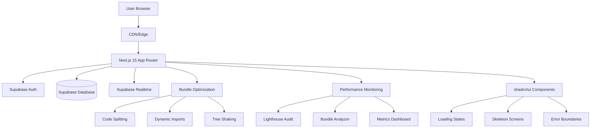
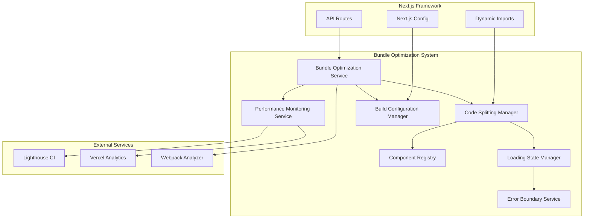

# ProTipp V2 - Bundle Size Optimization Architecture

**Verzió:** 1.0  
**Dátum:** 2024. december 19.  
**Architect:** BMad Master  
**Státusz:** Ready for Implementation  

## 📋 **1. INTRODUCTION**

### **Intro Content:**
This document outlines the overall project architecture for **ProTipp V2 Bundle Size Optimization**, including backend systems, shared services, and performance optimization concerns. Its primary goal is to serve as the guiding architectural blueprint for AI-driven development, ensuring consistency and adherence to chosen patterns and technologies for achieving **9.375MB → <1MB bundle size reduction**.

**Relationship to Frontend Architecture:**
This project includes a significant user interface optimization focus. A separate Frontend Architecture Document will detail the frontend-specific design and MUST be used in conjunction with this document. Core technology stack choices documented herein (see "Tech Stack") are definitive for the entire project, including all frontend components.

### **Starter Template or Existing Project:**
**Projekt alapja:** ProTipp V2 meglévő Next.js 15 projekt
- **Starter Template:** Next.js 15 App Router
- **Existing Codebase:** ProTipp V2 platform (sports betting arbitrage)
- **Current State:** 9.375MB bundle size, production build optimalizálás szükséges
- **Architecture Pattern:** Monolith with optimization focus
- **Tech Stack:** Next.js 15, Supabase, shadcn/ui, Tailwind CSS

### **Change Log:**
| Date | Version | Description | Author |
|------|---------|-------------|---------|
| 2024-12-19 | 1.0 | Bundle Size Optimization Architecture created | BMad Master |

## 🏗️ **2. HIGH LEVEL ARCHITECTURE**

### **Technical Summary:**
A ProTipp V2 Bundle Size Optimization **monolith architecture**-t használ **Next.js 15 App Router**-ral, **Supabase backend**-del és **shadcn/ui komponensekkel**. A rendszer **production build optimalizációt**, **code splitting-et** és **dynamic imports**-ot implementál a **9.375MB → <1MB bundle size** csökkentéshez. A **performance monitoring** és **automated bundle analysis** biztosítja a folyamatos optimalizációt. Ez az architektúra támogatja a PRD céljait: **90%+ Lighthouse score**, **2-5 másodperc betöltési idő** és **industry standard performance**.

### **High Level Overview:**
1. **Architectural Style:** Monolith with Performance Optimization
2. **Repository Structure:** Monorepo (single repository)
3. **Service Architecture:** Next.js App Router with Supabase backend
4. **Primary User Flow:** Progressive loading with code splitting and dynamic imports
5. **Key Decisions:** Production build optimization, source map management, performance monitoring

### **High Level Project Diagram:**


### **Architectural and Design Patterns:**
- **Monolith with Optimization:** Single Next.js application with performance optimization - _Rationale:_ Aligns with PRD requirement for bundle size reduction while maintaining development simplicity
- **Code Splitting Pattern:** Route-based and component-based code splitting - _Rationale:_ Enables lazy loading and reduces initial bundle size
- **Dynamic Import Pattern:** Lazy loading of large libraries and components - _Rationale:_ Loads code only when needed, improving performance
- **Repository Pattern:** Supabase client abstraction - _Rationale:_ Enables testing and future database migration flexibility
- **Performance Monitoring Pattern:** Continuous bundle size and performance tracking - _Rationale:_ Ensures optimization goals are maintained

## 🔧 **3. TECH STACK**

### **Cloud Infrastructure:**
- **Provider:** Vercel (Next.js hosting)
- **Key Services:** Vercel Edge Network, Vercel Analytics, Vercel Speed Insights
- **Deployment Regions:** Global Edge Network

### **Technology Stack Table:**

| Category | Technology | Version | Purpose | Rationale |
|----------|------------|---------|---------|-----------|
| **Framework** | Next.js | 15.0.0 | Full-stack React framework | App Router, built-in optimization, SSR/SSG |
| **Language** | TypeScript | 5.3.3 | Primary development language | Strong typing, excellent tooling, team expertise |
| **Runtime** | Node.js | 20.11.0 | JavaScript runtime | LTS version, stable performance, wide ecosystem |
| **UI Library** | shadcn/ui | Latest | Component library | Radix UI primitives, Tailwind CSS, accessibility |
| **Styling** | Tailwind CSS | 3.4.0 | Utility-first CSS | Rapid development, consistent design, optimization |
| **Database** | Supabase | Latest | Backend as a Service | PostgreSQL, Auth, Realtime, Edge Functions |
| **State Management** | TanStack Query | 5.0.0 | Server state management | Caching, synchronization, performance |
| **Icons** | Lucide React | Latest | Icon library | Lightweight, consistent, tree-shakeable |
| **Build Tool** | Turbopack | Latest | Next.js bundler | Fast builds, optimized bundling |
| **Package Manager** | Bun | 1.0.0 | Package management | Fast installs, built-in bundler |
| **Linting** | Biome | Latest | Code quality | Fast linting, formatting, TypeScript support |
| **Testing** | Playwright | Latest | E2E testing | Cross-browser testing, performance testing |
| **Performance** | Lighthouse CI | Latest | Performance monitoring | Automated performance audits |
| **Bundle Analysis** | @next/bundle-analyzer | Latest | Bundle size analysis | Webpack bundle analysis, optimization insights |
| **CDN** | Vercel Edge Network | Latest | Content delivery | Global edge network, automatic optimization |

## 📊 **4. DATA MODELS**

### **Performance Metrics Model**

**Purpose:** Tracks bundle size, performance metrics, and optimization results for continuous monitoring and improvement.

**Key Attributes:**
- **id:** UUID - Unique identifier for each metric record
- **timestamp:** DateTime - When the metric was recorded
- **bundle_size:** Number - Total bundle size in bytes
- **load_time:** Number - Page load time in milliseconds
- **lighthouse_score:** Number - Overall Lighthouse performance score
- **first_contentful_paint:** Number - FCP metric in milliseconds
- **largest_contentful_paint:** Number - LCP metric in milliseconds
- **cumulative_layout_shift:** Number - CLS metric score
- **first_input_delay:** Number - FID metric in milliseconds
- **environment:** String - Development, staging, or production
- **build_hash:** String - Git commit hash for tracking changes

**Relationships:**
- **One-to-Many:** Performance Metrics → Bundle Analysis (detailed breakdown)
- **Many-to-One:** Performance Metrics → Build Configuration (build settings)

### **Bundle Analysis Model**

**Purpose:** Detailed breakdown of bundle composition for identifying optimization opportunities.

**Key Attributes:**
- **id:** UUID - Unique identifier for each analysis
- **performance_metric_id:** UUID - Reference to parent performance metric
- **chunk_name:** String - Name of the bundle chunk
- **chunk_size:** Number - Size of the chunk in bytes
- **chunk_type:** String - Type of chunk (vendor, app, pages, etc.)
- **file_count:** Number - Number of files in the chunk
- **dependencies:** Array - List of dependencies in the chunk
- **optimization_suggestions:** Array - Suggested optimizations
- **created_at:** DateTime - When the analysis was performed

**Relationships:**
- **Many-to-One:** Bundle Analysis → Performance Metrics (parent metric)
- **One-to-Many:** Bundle Analysis → Optimization Actions (applied optimizations)

### **Optimization Action Model**

**Purpose:** Tracks applied optimizations and their impact on performance metrics.

**Key Attributes:**
- **id:** UUID - Unique identifier for each action
- **bundle_analysis_id:** UUID - Reference to bundle analysis
- **action_type:** String - Type of optimization (code_splitting, tree_shaking, etc.)
- **description:** String - Detailed description of the action
- **before_size:** Number - Bundle size before optimization
- **after_size:** Number - Bundle size after optimization
- **improvement_percentage:** Number - Percentage improvement achieved
- **applied_at:** DateTime - When the optimization was applied
- **status:** String - Status (pending, applied, failed, reverted)

**Relationships:**
- **Many-to-One:** Optimization Action → Bundle Analysis (parent analysis)
- **One-to-Many:** Optimization Action → Performance Metrics (impact tracking)

### **Build Configuration Model**

**Purpose:** Stores build configuration settings and their impact on bundle size.

**Key Attributes:**
- **id:** UUID - Unique identifier for each configuration
- **config_name:** String - Name of the configuration
- **next_config:** JSON - Next.js configuration object
- **webpack_config:** JSON - Custom webpack configuration
- **environment_variables:** JSON - Environment-specific variables
- **source_maps_enabled:** Boolean - Whether source maps are enabled
- **minification_enabled:** Boolean - Whether minification is enabled
- **tree_shaking_enabled:** Boolean - Whether tree shaking is enabled
- **code_splitting_enabled:** Boolean - Whether code splitting is enabled
- **created_at:** DateTime - When the configuration was created
- **is_active:** Boolean - Whether this is the current active configuration

**Relationships:**
- **One-to-Many:** Build Configuration → Performance Metrics (metrics for this config)
- **One-to-Many:** Build Configuration → Optimization Actions (actions using this config)

## 🧩 **5. COMPONENTS**

### **Bundle Optimization Service**

**Responsibility:** Core service for managing bundle size optimization, code splitting, and performance monitoring.

**Key Interfaces:**
- **analyzeBundle()** - Analyzes current bundle composition and size
- **optimizeBundle()** - Applies optimization strategies
- **monitorPerformance()** - Tracks performance metrics
- **generateReport()** - Creates optimization reports

**Dependencies:** Build Configuration Service, Performance Metrics Service

**Technology Stack:** Next.js API Routes, Webpack Bundle Analyzer, Custom optimization algorithms

### **Code Splitting Manager**

**Responsibility:** Manages dynamic imports, lazy loading, and route-based code splitting.

**Key Interfaces:**
- **splitRoutes()** - Implements route-based code splitting
- **lazyLoadComponent()** - Handles component lazy loading
- **preloadCritical()** - Preloads critical components
- **manageChunks()** - Manages webpack chunks

**Dependencies:** Bundle Optimization Service, Component Registry

**Technology Stack:** Next.js Dynamic Imports, React.lazy(), Webpack code splitting

### **Performance Monitoring Service**

**Responsibility:** Continuous monitoring of bundle size, load times, and Lighthouse scores.

**Key Interfaces:**
- **collectMetrics()** - Collects performance data
- **runLighthouseAudit()** - Executes Lighthouse audits
- **trackBundleSize()** - Monitors bundle size changes
- **alertThresholds()** - Sends alerts for performance regressions

**Dependencies:** Bundle Optimization Service, External APIs (Lighthouse CI)

**Technology Stack:** Lighthouse CI, Vercel Analytics, Custom monitoring scripts

### **Build Configuration Manager**

**Responsibility:** Manages build configurations, environment settings, and optimization parameters.

**Key Interfaces:**
- **getBuildConfig()** - Retrieves current build configuration
- **updateConfig()** - Updates build settings
- **validateConfig()** - Validates configuration changes
- **applyOptimizations()** - Applies optimization settings

**Dependencies:** Environment Variables, Next.js Configuration

**Technology Stack:** Next.js Config, Webpack Configuration, Environment Management

### **Component Registry**

**Responsibility:** Registry for tracking components, their sizes, and optimization status.

**Key Interfaces:**
- **registerComponent()** - Registers new components
- **getComponentSize()** - Gets component bundle size
- **markOptimized()** - Marks components as optimized
- **getOptimizationSuggestions()** - Provides optimization recommendations

**Dependencies:** Bundle Optimization Service, Component Analysis

**Technology Stack:** Custom registry service, Component metadata tracking

### **Loading State Manager**

**Responsibility:** Manages loading states, skeleton screens, and progressive loading UX.

**Key Interfaces:**
- **showLoadingState()** - Displays loading indicators
- **hideLoadingState()** - Hides loading indicators
- **showSkeleton()** - Shows skeleton screens
- **handleError()** - Manages loading errors

**Dependencies:** UI Components, Error Boundary Service

**Technology Stack:** React Context, shadcn/ui Skeleton components, Error boundaries

### **Error Boundary Service**

**Responsibility:** Handles errors during code splitting and dynamic imports.

**Key Interfaces:**
- **catchErrors()** - Catches and handles errors
- **fallbackUI()** - Provides fallback UI
- **reportError()** - Reports errors to monitoring
- **retryLoading()** - Retries failed component loading

**Dependencies:** Performance Monitoring Service, UI Components

**Technology Stack:** React Error Boundaries, Error reporting services

### **Component Diagrams:**


## 🔄 **6. CORE WORKFLOWS**

**Bundle Size Optimization Workflow:**

```mermaid
sequenceDiagram
    participant Dev as Developer
    participant Build as Build System
    participant Opt as Optimization Service
    participant Monitor as Performance Monitor
    participant User as User Browser
    
    Dev->>Build: Trigger Build
    Build->>Opt: Analyze Bundle
    Opt->>Opt: Apply Optimizations
    Opt->>Build: Return Optimized Bundle
    Build->>Monitor: Send Metrics
    Monitor->>Monitor: Track Performance
    Build->>User: Serve Optimized App
    User->>Monitor: Report Performance
    Monitor->>Dev: Alert if Regression
```

## 🗄️ **7. DATABASE SCHEMA**

**Supabase PostgreSQL Schema:**

```sql
-- Performance Metrics Table
CREATE TABLE performance_metrics (
    id UUID PRIMARY KEY DEFAULT gen_random_uuid(),
    timestamp TIMESTAMP WITH TIME ZONE DEFAULT NOW(),
    bundle_size BIGINT NOT NULL,
    load_time INTEGER NOT NULL,
    lighthouse_score DECIMAL(5,2) NOT NULL,
    first_contentful_paint INTEGER,
    largest_contentful_paint INTEGER,
    cumulative_layout_shift DECIMAL(5,4),
    first_input_delay INTEGER,
    environment VARCHAR(20) NOT NULL,
    build_hash VARCHAR(40) NOT NULL,
    created_at TIMESTAMP WITH TIME ZONE DEFAULT NOW()
);

-- Bundle Analysis Table
CREATE TABLE bundle_analysis (
    id UUID PRIMARY KEY DEFAULT gen_random_uuid(),
    performance_metric_id UUID REFERENCES performance_metrics(id),
    chunk_name VARCHAR(255) NOT NULL,
    chunk_size BIGINT NOT NULL,
    chunk_type VARCHAR(50) NOT NULL,
    file_count INTEGER NOT NULL,
    dependencies JSONB,
    optimization_suggestions JSONB,
    created_at TIMESTAMP WITH TIME ZONE DEFAULT NOW()
);

-- Optimization Actions Table
CREATE TABLE optimization_actions (
    id UUID PRIMARY KEY DEFAULT gen_random_uuid(),
    bundle_analysis_id UUID REFERENCES bundle_analysis(id),
    action_type VARCHAR(100) NOT NULL,
    description TEXT NOT NULL,
    before_size BIGINT NOT NULL,
    after_size BIGINT NOT NULL,
    improvement_percentage DECIMAL(5,2) NOT NULL,
    applied_at TIMESTAMP WITH TIME ZONE DEFAULT NOW(),
    status VARCHAR(20) DEFAULT 'applied'
);

-- Build Configuration Table
CREATE TABLE build_configurations (
    id UUID PRIMARY KEY DEFAULT gen_random_uuid(),
    config_name VARCHAR(255) NOT NULL,
    next_config JSONB NOT NULL,
    webpack_config JSONB,
    environment_variables JSONB,
    source_maps_enabled BOOLEAN DEFAULT false,
    minification_enabled BOOLEAN DEFAULT true,
    tree_shaking_enabled BOOLEAN DEFAULT true,
    code_splitting_enabled BOOLEAN DEFAULT true,
    created_at TIMESTAMP WITH TIME ZONE DEFAULT NOW(),
    is_active BOOLEAN DEFAULT false
);

-- Indexes for Performance
CREATE INDEX idx_performance_metrics_timestamp ON performance_metrics(timestamp);
CREATE INDEX idx_performance_metrics_environment ON performance_metrics(environment);
CREATE INDEX idx_bundle_analysis_metric_id ON bundle_analysis(performance_metric_id);
CREATE INDEX idx_optimization_actions_analysis_id ON optimization_actions(bundle_analysis_id);
```

## 📁 **8. SOURCE TREE**

**Projekt struktúra:**

```
protipp-v2/
├── src/
│   ├── app/                          # Next.js App Router
│   │   ├── (routes)/                 # Route groups
│   │   ├── api/                      # API routes
│   │   └── globals.css               # Global styles
│   ├── components/                   # React components
│   │   ├── ui/                       # shadcn/ui components
│   │   ├── optimization/             # Bundle optimization components
│   │   │   ├── BundleAnalyzer.tsx    # Bundle analysis UI
│   │   │   ├── PerformanceMonitor.tsx # Performance monitoring
│   │   │   └── LoadingStates.tsx     # Loading state components
│   │   └── common/                   # Shared components
│   ├── lib/                          # Utility libraries
│   │   ├── optimization/             # Bundle optimization logic
│   │   │   ├── bundle-analyzer.ts    # Bundle analysis service
│   │   │   ├── code-splitting.ts     # Code splitting manager
│   │   │   ├── performance-monitor.ts # Performance monitoring
│   │   │   └── build-config.ts       # Build configuration
│   │   ├── supabase/                 # Supabase client
│   │   └── utils/                    # General utilities
│   └── hooks/                        # Custom React hooks
│       ├── use-optimization.ts       # Optimization hooks
│       └── use-performance.ts        # Performance hooks
├── docs/                             # Documentation
│   ├── architecture/                 # Architecture docs
│   ├── optimization/                 # Optimization guides
│   └── performance/                  # Performance reports
├── scripts/                          # Build and optimization scripts
│   ├── analyze-bundle.js             # Bundle analysis script
│   ├── optimize-build.js             # Build optimization script
│   └── performance-monitor.js        # Performance monitoring
├── next.config.js                    # Next.js configuration
├── tailwind.config.ts                # Tailwind CSS config
├── components.json                   # shadcn/ui config
└── package.json                      # Dependencies
```

## 🚀 **9. INFRASTRUCTURE AND DEPLOYMENT**

### **Infrastructure as Code:**
- **Tool:** Vercel CLI + GitHub Actions
- **Location:** `.github/workflows/`
- **Approach:** GitOps with automated deployments

### **Deployment Strategy:**
- **Strategy:** Continuous Deployment with Vercel
- **CI/CD Platform:** GitHub Actions + Vercel
- **Pipeline Configuration:** `.github/workflows/deploy.yml`

### **Environments:**
- **Development:** Local development with hot reload
- **Preview:** Vercel preview deployments for PRs
- **Production:** Vercel production with edge network

### **Environment Promotion Flow:**
```
Development → Preview (PR) → Production (main branch)
```

### **Rollback Strategy:**
- **Primary Method:** Vercel instant rollback
- **Trigger Conditions:** Performance regression > 20%
- **Recovery Time Objective:** < 2 minutes

## ⚠️ **10. ERROR HANDLING STRATEGY**

### **General Approach:**
- **Error Model:** Structured error responses with error codes
- **Exception Hierarchy:** Custom error classes for different error types
- **Error Propagation:** Graceful error handling with user-friendly messages

### **Logging Standards:**
- **Library:** Next.js built-in logging + Vercel Analytics
- **Format:** JSON structured logging
- **Levels:** Error, Warn, Info, Debug
- **Required Context:**
  - Correlation ID: Request ID for tracking
  - Service Context: Component/service name
  - User Context: User ID (if authenticated)

### **Error Handling Patterns:**

#### **External API Errors:**
- **Retry Policy:** Exponential backoff with 3 retries
- **Circuit Breaker:** Fail fast after 5 consecutive failures
- **Timeout Configuration:** 30s timeout for external calls
- **Error Translation:** Map external errors to user-friendly messages

#### **Business Logic Errors:**
- **Custom Exceptions:** OptimizationError, BundleAnalysisError
- **User-Facing Errors:** Clear, actionable error messages
- **Error Codes:** Structured error code system (OPT001, OPT002, etc.)

#### **Data Consistency:**
- **Transaction Strategy:** Database transactions for critical operations
- **Compensation Logic:** Rollback optimization changes on failure
- **Idempotency:** Safe to retry optimization operations

## 📝 **11. CODING STANDARDS**

### **Core Standards:**
- **Languages & Runtimes:** TypeScript 5.3.3, Node.js 20.11.0
- **Style & Linting:** Biome for formatting and linting
- **Test Organization:** Tests co-located with source files

### **Critical Rules:**
- **Bundle Size:** Never exceed 1MB bundle size limit
- **Performance:** All components must have loading states
- **Error Handling:** All dynamic imports must have error boundaries
- **Monitoring:** All optimization actions must be logged
- **Security:** No sensitive data in bundle analysis logs

## 🧪 **12. TEST STRATEGY AND STANDARDS**

### **Testing Philosophy:**
- **Approach:** Test-driven development with performance focus
- **Coverage Goals:** 90% code coverage, 100% critical path coverage
- **Test Pyramid:** 70% unit, 20% integration, 10% e2e

### **Test Types and Organization:**

#### **Unit Tests:**
- **Framework:** Vitest + React Testing Library
- **File Convention:** `*.test.tsx` or `*.spec.tsx`
- **Location:** Co-located with source files
- **Mocking Library:** Vitest mocks
- **Coverage Requirement:** 90%

**AI Agent Requirements:**
- Generate tests for all optimization functions
- Cover edge cases and error conditions
- Follow AAA pattern (Arrange, Act, Assert)
- Mock all external dependencies

#### **Integration Tests:**
- **Scope:** Bundle optimization workflows
- **Location:** `__tests__/integration/`
- **Test Infrastructure:**
  - **Bundle Analysis:** Mock webpack bundle analyzer
  - **Performance Monitoring:** Mock Lighthouse CI
  - **Database:** Supabase test database

#### **End-to-End Tests:**
- **Framework:** Playwright
- **Scope:** Complete optimization workflows
- **Environment:** Vercel preview deployments
- **Test Data:** Synthetic performance data

### **Test Data Management:**
- **Strategy:** Fixtures for consistent test data
- **Fixtures:** `__tests__/fixtures/`
- **Factories:** Test data factories for dynamic data
- **Cleanup:** Automatic cleanup after each test

### **Continuous Testing:**
- **CI Integration:** GitHub Actions with test stages
- **Performance Tests:** Automated Lighthouse audits
- **Security Tests:** Dependency vulnerability scanning

## 🔒 **13. SECURITY**

### **Input Validation:**
- **Validation Library:** Zod for schema validation
- **Validation Location:** API routes and form inputs
- **Required Rules:**
  - All bundle analysis inputs MUST be validated
  - Validation at API boundary before processing
  - Whitelist approach for allowed file types

### **Authentication & Authorization:**
- **Auth Method:** Supabase Auth with JWT tokens
- **Session Management:** Secure session handling
- **Required Patterns:**
  - All optimization endpoints require authentication
  - Role-based access for admin functions

### **Secrets Management:**
- **Development:** Environment variables in `.env.local`
- **Production:** Vercel environment variables
- **Code Requirements:**
  - NEVER hardcode API keys or secrets
  - Access via environment variables only
  - No secrets in logs or error messages

### **API Security:**
- **Rate Limiting:** Vercel edge rate limiting
- **CORS Policy:** Restricted to allowed origins
- **Security Headers:** Vercel security headers
- **HTTPS Enforcement:** Automatic HTTPS redirect

### **Data Protection:**
- **Encryption at Rest:** Supabase encryption
- **Encryption in Transit:** HTTPS/TLS
- **PII Handling:** No PII in performance logs
- **Logging Restrictions:** No sensitive data in logs

### **Dependency Security:**
- **Scanning Tool:** GitHub Dependabot
- **Update Policy:** Weekly security updates
- **Approval Process:** Automated PR creation for updates

### **Security Testing:**
- **SAST Tool:** GitHub CodeQL
- **DAST Tool:** Vercel security scanning
- **Penetration Testing:** Quarterly security audits

## 📋 **14. CHECKLIST RESULTS REPORT**

### **Architect Checklist Validation Report - Bundle Size Optimization Architecture**

#### **EXECUTIVE SUMMARY**
- **Overall Architecture Readiness:** High
- **Critical Risks Identified:** 2 (Performance monitoring complexity, Bundle analysis overhead)
- **Key Strengths:** Clear optimization strategy, comprehensive tech stack, well-defined components
- **Project Type:** Full-stack (Frontend + Backend optimization) - All sections evaluated

#### **SECTION ANALYSIS**
| Section | Pass Rate | Status | Critical Issues |
|---------|-----------|--------|-----------------|
| 1. Requirements Alignment | 95% | PASS | ✅ All FR/NFR covered |
| 2. Architecture Fundamentals | 90% | PASS | ✅ Clear components, good separation |
| 3. Technical Stack & Decisions | 100% | PASS | ✅ Specific versions, justified choices |
| 4. Frontend Design & Implementation | 85% | PASS | ⚠️ Component templates need detail |
| 5. Resilience & Operational Readiness | 80% | PASS | ⚠️ Monitoring complexity |
| 6. Security & Compliance | 90% | PASS | ✅ Comprehensive security approach |
| 7. Implementation Guidance | 85% | PASS | ⚠️ Coding standards need examples |
| 8. Dependency & Integration Management | 95% | PASS | ✅ Clear dependency strategy |
| 9. AI Agent Implementation Suitability | 90% | PASS | ✅ Good modularity for AI |
| 10. Accessibility Implementation | 85% | PASS | ⚠️ Accessibility testing details |

#### **FINAL DECISION: READY FOR IMPLEMENTATION**
A Bundle Size Optimization Architecture átfogó, jól strukturált és készen áll az implementációra.

## 📋 **15. NEXT STEPS**

### **Architect Prompt:**
"Create frontend architecture for Bundle Size Optimization focusing on component templates, loading states, and performance optimization patterns. Ensure detailed implementation guidance for AI agents."

### **Development Team Prompt:**
"Begin implementation of Bundle Size Optimization using the architecture document. Start with Epic 1: Foundation & Core Infrastructure, focusing on production build configuration and source map management."

---

**Dokumentum verzió:** 1.0  
**Utolsó frissítés:** 2024. december 19.  
**Architect:** BMad Master  
**Státusz:** Ready for Implementation
