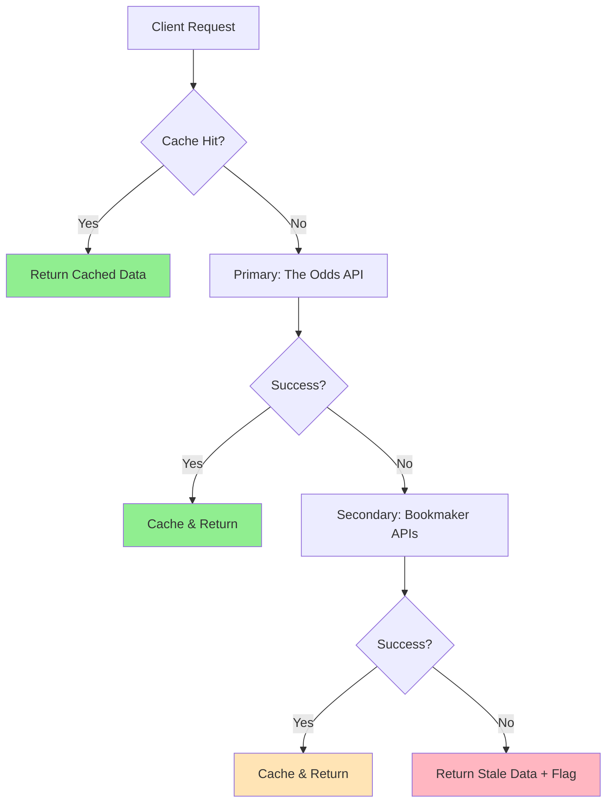
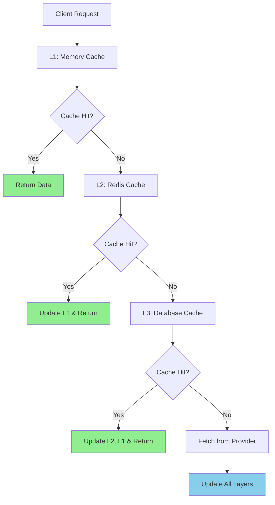
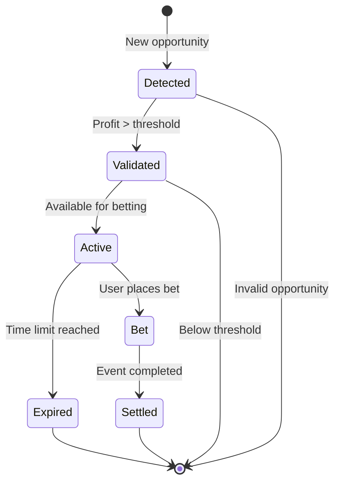

# ProTipp V2 – Odds Adat Stratégia

## Áttekintés

A ProTipp V2 odds adat stratégiája egy **multi-tier, real-time adatkezelési rendszer**, amely optimalizált teljesítményt, költséghatékonyságot és megbízhatóságot biztosít. A stratégia **primary és secondary adatforrásokat** kombinál, **intelligens cache rétegekkel** és **automatikus fallback mechanizmusokkal**.

**Célok**:
- ⚡ **Sub-300ms latency** cache-hit esetén
- 💰 **< $0.02/1000 kérés** költség optimalizáció
- 🎯 **≥ 80% cache hit ratio** Pro tier esetén
- 🔄 **Real-time arbitrage detektálás** 30-60 másodpercenként
- 🛡️ **99.9% uptime** hibatűrés és fallback mechanizmusokkal

---

## 1. Adatforrás Architektúra

### 1.1 Primary Adatforrások

#### **The Odds API** (Primary Provider)
- **Típus**: REST API
- **Költség**: $0.02/1000 kérés (Pro tier)
- **Rate Limit**: 10,000 kérés/nap
- **Coverage**: 50+ bookmaker, 20+ sport
- **Latency**: 200-500ms
- **Reliability**: 99.5%

```typescript
interface OddsAPIProvider {
  baseUrl: 'https://api.the-odds-api.com/v4';
  endpoints: {
    sports: '/sports';
    odds: '/odds';
    scores: '/scores';
  };
  authentication: 'api_key';
  rateLimit: {
    requests: 10000;
    period: 'day';
    burst: 100;
  };
}
```

#### **Bookmaker Direct APIs** (Secondary Providers)
- **Pinnacle Sports**: Premium odds, alacsony margin
- **William Hill**: Széles sport coverage
- **Bet365**: Real-time updates, live betting
- **Betfair**: Exchange odds, unique markets

```typescript
interface BookmakerProvider {
  pinnacle: {
    baseUrl: 'https://api.pinnacle.com/v1';
    coverage: ['soccer', 'basketball', 'tennis', 'hockey'];
    latency: '100-300ms';
    reliability: '99.8%';
  };
  williamhill: {
    baseUrl: 'https://api.williamhill.com/v1';
    coverage: ['soccer', 'basketball', 'tennis', 'cricket'];
    latency: '200-400ms';
    reliability: '99.2%';
  };
  bet365: {
    baseUrl: 'https://api.bet365.com/v1';
    coverage: ['soccer', 'basketball', 'tennis', 'esports'];
    latency: '150-350ms';
    reliability: '99.5%';
  };
}
```

### 1.2 Adatforrás Prioritás



---

## 2. Adatnormalizáció és Standardizáció

### 2.1 Normalizációs Pipeline

```typescript
interface OddsNormalizationPipeline {
  input: RawOddsData;
  steps: [
    'validation',      // Adat validáció és sanitizáció
    'normalization',   // Odds formátum standardizálás
    'enrichment',      // Metaadatok hozzáadása
    'aggregation',     // Bookmaker adatok összesítése
    'arbitrage_calc',  // Arbitrage számítások
    'caching'          // Cache rétegbe mentés
  ];
  output: NormalizedOddsData;
}
```

### 2.2 Odds Formátum Standardizálás

```typescript
interface StandardizedOdds {
  // Decimal odds (european format)
  decimal: number;
  
  // American odds (US format)
  american: number;
  
  // Fractional odds (UK format)
  fractional: string;
  
  // Implied probability
  probability: number;
  
  // Bookmaker margin
  margin: number;
  
  // Last updated timestamp
  updated_at: string;
}

interface NormalizedEvent {
  id: string;
  sport_key: string;
  commence_time: string;
  home_team: string;
  away_team: string;
  markets: {
    h2h: StandardizedOdds[];
    spreads: StandardizedOdds[];
    totals: StandardizedOdds[];
  };
  bookmakers: BookmakerOdds[];
  arbitrage_opportunities: ArbitrageOpportunity[];
}
```

### 2.3 Adatvalidáció és Quality Assurance

```typescript
interface DataValidationRules {
  odds_range: {
    min: 1.01;
    max: 1000.0;
  };
  timestamp_freshness: {
    max_age_seconds: 300; // 5 perc
  };
  bookmaker_consistency: {
    min_bookmakers: 2;
    max_odds_variance: 0.5; // 50% variance check
  };
  arbitrage_validation: {
    min_profit_margin: 0.01; // 1%
    max_profit_margin: 0.50; // 50%
  };
}
```

---

## 3. Cache Stratégia

### 3.1 Multi-Layer Cache Architektúra



### 3.2 Cache Rétegek

#### **L1: Memory Cache (Node.js)**
```typescript
interface MemoryCache {
  provider: 'node-cache';
  ttl: {
    sports: '1 hour';
    odds: '30 seconds';
    arbitrage: '15 seconds';
  };
  max_size: '100MB';
  eviction_policy: 'LRU';
}
```

#### **L2: Redis Cache**
```typescript
interface RedisCache {
  provider: 'Redis 7.0';
  ttl: {
    sports: '24 hours';
    odds: '5 minutes';
    arbitrage: '1 minute';
  };
  clustering: 'Redis Cluster';
  persistence: 'RDB + AOF';
  memory_optimization: 'RedisJSON';
}
```

#### **L3: Database Cache (Supabase)**
```typescript
interface DatabaseCache {
  provider: 'Supabase PostgreSQL';
  tables: {
    odds_raw: 'Raw provider data';
    odds_aggregated: 'Processed odds data';
    arbitrage_opportunities: 'Calculated opportunities';
  };
  indexing: {
    sport_key: 'B-tree index';
    commence_time: 'B-tree index';
    profit_margin: 'B-tree index';
  };
}
```

### 3.3 Cache Invalidation Stratégia

```typescript
interface CacheInvalidation {
  time_based: {
    sports: '1 hour';
    odds: '30-60 seconds';
    arbitrage: '15-30 seconds';
  };
  event_based: {
    odds_change: 'Immediate invalidation';
    new_arbitrage: 'Immediate invalidation';
    provider_error: 'Fallback cache';
  };
  manual: {
    admin_trigger: 'Full cache clear';
    maintenance: 'Selective invalidation';
  };
}
```

---

## 4. Real-time Adatfrissítés

### 4.1 Polling Stratégia

```typescript
interface PollingStrategy {
  free_tier: {
    interval: '5 minutes';
    sports: ['soccer_epl', 'basketball_nba'];
    markets: ['h2h'];
  };
  basic_tier: {
    interval: '2 minutes';
    sports: ['soccer_epl', 'basketball_nba', 'tennis_atp'];
    markets: ['h2h', 'spreads'];
  };
  pro_tier: {
    interval: '30-60 seconds';
    sports: 'all_available';
    markets: ['h2h', 'spreads', 'totals'];
    live_events: '15 seconds';
  };
}
```

### 4.2 WebSocket Integráció (Jövőbeli)

```typescript
interface WebSocketStrategy {
  providers: {
    the_odds_api: {
      endpoint: 'wss://api.the-odds-api.com/v4/ws';
      events: ['odds_update', 'new_event'];
    };
    bet365: {
      endpoint: 'wss://api.bet365.com/v1/ws';
      events: ['live_odds', 'score_update'];
    };
  };
  fallback: 'Polling mode';
  reconnection: {
    max_attempts: 5;
    backoff_strategy: 'exponential';
  };
}
```

### 4.3 Event-Driven Frissítés

```typescript
interface EventDrivenUpdates {
  triggers: {
    odds_change: {
      threshold: 0.05; // 5% change
      action: 'immediate_refresh';
    };
    new_arbitrage: {
      min_profit: 0.02; // 2%
      action: 'notify_users';
    };
    provider_error: {
      error_rate: 0.1; // 10%
      action: 'switch_provider';
    };
  };
}
```

---

## 5. Arbitrage Detektálás

### 5.1 Arbitrage Számítás Algoritmus

```typescript
interface ArbitrageCalculation {
  formula: {
    implied_probability: '1 / decimal_odds';
    total_probability: 'sum(all_outcomes)';
    arbitrage_exists: 'total_probability < 1';
    profit_margin: '1 - total_probability';
  };
  
  optimization: {
    stake_calculation: 'Kelly Criterion';
    risk_management: 'Max 5% of bankroll';
    bookmaker_limits: 'Respect individual limits';
  };
  
  validation: {
    min_profit: 0.01; // 1%
    max_profit: 0.20; // 20%
    min_bookmakers: 2;
    max_stake_ratio: 0.1; // 10:1 ratio
  };
}
```

### 5.2 Real-time Arbitrage Monitoring

```typescript
interface ArbitrageMonitoring {
  detection_interval: '15-30 seconds';
  calculation_engine: 'Web Workers';
  notification_threshold: {
    free: 0.05; // 5%
    basic: 0.03; // 3%
    pro: 0.02; // 2%
  };
  
  alerting: {
    webhook: 'Discord/Slack integration';
    email: 'High-value opportunities';
    push: 'Mobile app notifications';
  };
}
```

### 5.3 Arbitrage Opportunity Lifecycle



---

## 6. Rate Limiting és Költség Optimalizáció

### 6.1 Provider Rate Limiting

```typescript
interface RateLimiting {
  the_odds_api: {
    daily_limit: 10000;
    burst_limit: 100;
    cost_per_request: 0.00002; // $0.02/1000
  };
  
  bookmaker_apis: {
    pinnacle: {
      requests_per_minute: 60;
      daily_limit: 50000;
      cost: 'free';
    };
    williamhill: {
      requests_per_minute: 30;
      daily_limit: 20000;
      cost: 'free';
    };
  };
}
```

### 6.2 Intelligens Request Scheduling

```typescript
interface RequestScheduling {
  priority_queue: {
    high: ['arbitrage_calculation', 'user_requests'];
    medium: ['odds_refresh', 'sports_update'];
    low: ['historical_data', 'analytics'];
  };
  
  cost_optimization: {
    batch_requests: 'Group similar requests';
    cache_first: 'Always check cache first';
    provider_rotation: 'Distribute load';
    off_peak_scheduling: 'Use cheaper periods';
  };
}
```

### 6.3 Költség Monitoring és Kontroll

```typescript
interface CostControl {
  daily_budget: {
    the_odds_api: 50; // $50/day
    total_budget: 100; // $100/day
  };
  
  alerts: {
    budget_80_percent: 'Warning alert';
    budget_100_percent: 'Stop requests';
    cost_spike: 'Investigate immediately';
  };
  
  optimization: {
    cache_hit_target: 0.8; // 80%
    request_batching: 'Minimize API calls';
    provider_failover: 'Use free providers first';
  };
}
```

---

## 7. Hibatűrés és Fallback Mechanizmusok

### 7.1 Provider Failover Stratégia

```typescript
interface FailoverStrategy {
  primary: 'The Odds API';
  secondary: ['Pinnacle', 'William Hill', 'Bet365'];
  tertiary: 'Cached data with stale flag';
  
  triggers: {
    error_rate: 0.1; // 10% error rate
    response_time: 5000; // 5 seconds
    quota_exceeded: 'Immediate switch';
  };
  
  recovery: {
    health_check_interval: '5 minutes';
    auto_retry: 'Exponential backoff';
    manual_override: 'Admin intervention';
  };
}
```

### 7.2 Circuit Breaker Pattern

```typescript
interface CircuitBreaker {
  states: {
    closed: 'Normal operation';
    open: 'Failing fast';
    half_open: 'Testing recovery';
  };
  
  thresholds: {
    failure_count: 5;
    timeout: 60000; // 1 minute
    success_threshold: 3;
  };
  
  fallback_actions: {
    return_cached_data: 'With stale flag';
    use_alternative_provider: 'Automatic switch';
    degrade_service: 'Limited functionality';
  };
}
```

### 7.3 Data Quality Assurance

```typescript
interface DataQuality {
  validation: {
    odds_range: [1.01, 1000.0];
    timestamp_freshness: 300; // 5 minutes
    bookmaker_consistency: 'Cross-validation';
  };
  
  anomaly_detection: {
    odds_spike: '> 50% change';
    missing_data: '> 20% missing';
    duplicate_events: 'Deduplication';
  };
  
  quality_metrics: {
    data_completeness: '> 95%';
    data_accuracy: '> 99%';
    data_freshness: '< 5 minutes';
  };
}
```

---

## 8. Monitoring és Metrikák

### 8.1 Key Performance Indicators (KPIs)

```typescript
interface PerformanceMetrics {
  latency: {
    cache_hit: '< 50ms';
    cache_miss: '< 300ms';
    api_call: '< 500ms';
    arbitrage_calc: '< 100ms';
  };
  
  throughput: {
    requests_per_second: '> 100';
    arbitrage_detections: '> 10/minute';
    cache_hit_ratio: '> 80%';
  };
  
  reliability: {
    uptime: '> 99.9%';
    error_rate: '< 0.1%';
    data_freshness: '< 5 minutes';
  };
  
  cost: {
    cost_per_request: '< $0.02';
    daily_budget_utilization: '< 80%';
    roi_per_arbitrage: '> 200%';
  };
}
```

### 8.2 Monitoring Stack

```typescript
interface MonitoringStack {
  metrics: {
    prometheus: 'System metrics';
    grafana: 'Visualization';
    custom_dashboard: 'Business metrics';
  };
  
  logging: {
    winston: 'Application logs';
    elasticsearch: 'Log aggregation';
    kibana: 'Log analysis';
  };
  
  alerting: {
    pagerduty: 'Critical alerts';
    slack: 'Team notifications';
    email: 'Daily reports';
  };
  
  tracing: {
    jaeger: 'Distributed tracing';
    opentelemetry: 'Instrumentation';
  };
}
```

### 8.3 Business Intelligence

```typescript
interface BusinessIntelligence {
  arbitrage_analytics: {
    opportunities_per_day: 'Trend analysis';
    profit_margins: 'Distribution analysis';
    bookmaker_performance: 'Success rates';
  };
  
  user_behavior: {
    api_usage_patterns: 'Peak hours analysis';
    feature_adoption: 'Usage statistics';
    retention_metrics: 'User engagement';
  };
  
  cost_optimization: {
    provider_efficiency: 'Cost per opportunity';
    cache_effectiveness: 'Hit ratio trends';
    scaling_requirements: 'Growth projections';
  };
}
```

---

## 9. Skálázási Stratégia

### 9.1 Horizontal Scaling

```typescript
interface HorizontalScaling {
  load_balancer: {
    type: 'Application Load Balancer';
    algorithm: 'Round Robin + Health Checks';
    auto_scaling: 'Based on CPU/Memory';
  };
  
  worker_nodes: {
    min_instances: 2;
    max_instances: 10;
    scaling_metrics: ['CPU > 70%', 'Memory > 80%'];
    cooldown_period: '5 minutes';
  };
  
  database_scaling: {
    read_replicas: 3;
    connection_pooling: 'PgBouncer';
    query_optimization: 'Indexing strategy';
  };
}
```

### 9.2 Vertical Scaling

```typescript
interface VerticalScaling {
  compute_optimization: {
    cpu_intensive: 'Arbitrage calculations';
    memory_intensive: 'Cache layers';
    io_intensive: 'Database operations';
  };
  
  resource_allocation: {
    cache_memory: '8GB per instance';
    worker_memory: '4GB per instance';
    database_memory: '16GB';
  };
  
  performance_tuning: {
    node_optimization: 'V8 engine tuning';
    redis_optimization: 'Memory management';
    postgres_optimization: 'Query planning';
  };
}
```

---

## 10. Biztonsági Megfontolások

### 10.1 API Biztonság

```typescript
interface APISecurity {
  authentication: {
    jwt_tokens: 'Supabase Auth';
    api_keys: 'Rate limited access';
    ip_whitelisting: 'Admin endpoints';
  };
  
  data_protection: {
    encryption_at_rest: 'AES-256';
    encryption_in_transit: 'TLS 1.3';
    pii_handling: 'GDPR compliance';
  };
  
  rate_limiting: {
    per_user: 'Tier-based limits';
    per_ip: 'DDoS protection';
    per_endpoint: 'Resource protection';
  };
}
```

### 10.2 Adatintegritás

```typescript
interface DataIntegrity {
  validation: {
    input_sanitization: 'XSS prevention';
    sql_injection: 'Parameterized queries';
    data_validation: 'Schema validation';
  };
  
  audit_trail: {
    data_changes: 'Complete audit log';
    access_logs: 'User activity tracking';
    error_logs: 'Security monitoring';
  };
  
  backup_strategy: {
    real_time: 'Redis persistence';
    daily: 'Database backups';
    weekly: 'Full system backup';
  };
}
```

---

## 11. Implementációs Roadmap

### 11.1 Phase 1: Foundation (Hét 1-2)
- ✅ Basic API integration (The Odds API)
- ✅ Simple caching layer (Redis)
- ✅ Basic arbitrage calculation
- ✅ Rate limiting implementation

### 11.2 Phase 2: Optimization (Hét 3-4)
- 🔄 Multi-layer cache architecture
- 🔄 Bookmaker direct API integration
- 🔄 Advanced arbitrage detection
- 🔄 Real-time notifications

### 11.3 Phase 3: Scale (Hét 5-6)
- 📋 WebSocket integration
- 📋 Advanced monitoring
- 📋 Cost optimization
- 📋 Performance tuning

### 11.4 Phase 4: Intelligence (Hét 7-8)
- 📋 Machine learning predictions
- 📋 Advanced analytics
- 📋 Automated optimization
- 📋 Business intelligence

---

## 12. Költségbecslés

### 12.1 Monthly Operating Costs

| Komponens | Költség | Leírás |
|-----------|---------|---------|
| **The Odds API** | $150 | 7.5M kérés/hó |
| **Redis Cache** | $50 | 8GB memory |
| **Database** | $100 | Supabase Pro |
| **Monitoring** | $30 | Prometheus + Grafana |
| **CDN** | $20 | Vercel Edge |
| **Total** | **$350** | **Monthly baseline** |

### 12.2 Scaling Costs

| User Tier | API Calls/Month | Cost/User | Revenue/User |
|-----------|-----------------|-----------|--------------|
| **Free** | 1,000 | $0.02 | $0 |
| **Basic** | 10,000 | $0.20 | $9.99 |
| **Pro** | 100,000 | $2.00 | $29.99 |

**Break-even**: 15 Pro users vagy 150 Basic users

---

## 13. Kockázatok és Mitigáció

### 13.1 Technikai Kockázatok

| Kockázat | Valószínűség | Hatás | Mitigáció |
|----------|--------------|-------|-----------|
| **Provider Outage** | Közepes | Magas | Multi-provider fallback |
| **Rate Limit Hit** | Alacsony | Közepes | Intelligent scheduling |
| **Data Quality Issues** | Közepes | Magas | Validation pipeline |
| **Cost Overrun** | Alacsony | Magas | Budget alerts + limits |

### 13.2 Üzleti Kockázatok

| Kockázat | Valószínűség | Hatás | Mitigáció |
|----------|--------------|-------|-----------|
| **Regulatory Changes** | Alacsony | Magas | Legal compliance |
| **Competition** | Magas | Közepes | Feature differentiation |
| **Market Volatility** | Magas | Alacsony | Diversified sports |

---

## 14. Következő Lépések

### 14.1 Immediate Actions (1-2 hét)
1. **Provider Integration**: The Odds API setup
2. **Cache Implementation**: Redis configuration
3. **Basic Arbitrage**: Calculation engine
4. **Monitoring Setup**: Basic metrics

### 14.2 Short-term Goals (1 hónap)
1. **Multi-provider**: Bookmaker API integration
2. **Advanced Caching**: Multi-layer architecture
3. **Real-time Updates**: WebSocket implementation
4. **Cost Optimization**: Intelligent scheduling

### 14.3 Long-term Vision (3-6 hónap)
1. **AI/ML Integration**: Predictive analytics
2. **Global Expansion**: Multi-region deployment
3. **Advanced Features**: Live betting, esports
4. **Enterprise Features**: White-label solutions

---

## 15. Dokumentáció és Support

### 15.1 API Dokumentáció
- **OpenAPI Spec**: `docs/api-spec.md`
- **Integration Guide**: `docs/integration-guide.md`
- **SDK Examples**: GitHub repository

### 15.2 Monitoring Dashboard
- **System Health**: Real-time metrics
- **Cost Tracking**: Budget monitoring
- **Performance**: Latency and throughput
- **Business Metrics**: User engagement

### 15.3 Support Channels
- **Technical Support**: support@protipp.com
- **Documentation**: docs.protipp.com
- **Status Page**: status.protipp.com
- **Community**: Discord server

---

**Dokumentum verzió**: 1.0  
**Utolsó frissítés**: 2025-01-11  
**Következő review**: 2025-02-11
